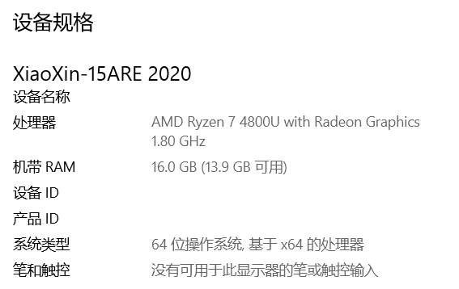
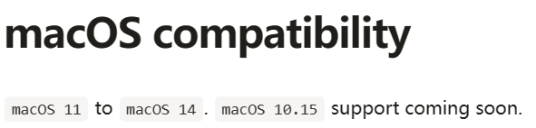
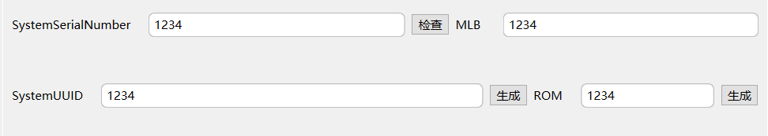

<h1 align="Center">Lenovo Xiaoxin-15ARE 2020 Hackintosh</h1>

<h5 align = "Center">作者：Zrc00.</h5>

#### 设备信息:

#### EFI选择

**你需要根据你想要安装的macOS系统版本，选择相应的EFI。**

Nootedred.kext（AMD核显驱动）暂时仅支持`macOS Big Sur（11）`以上系统，其开发者表示`macOS Catalina（10.15）`的支持即将推出。

这里提供了3个本机型的EFI，其中有macOS Big Sur至macOS Ventura的通用EFI，有macOS Big Sur的专用EFI（备用），以及macOS Sonoma Beta版本的专用EFI。

**某些与本机配置接近的小新笔记本也适用于本EFI。**

#### macOS版本选择:

|    系统版本    |        特点        |
| :------------: | :----------------: |
| macOS Big Sur  | 最为稳定，最为推荐 |
| macOS Monterey |      未经测试      |
| macOS Ventura  |  不稳定，有时卡死  |
|  macOS Sonoma  |  测试版本，不稳定  |

#### 详细配置表：

| 硬件类型 |                    硬件名称                    | 驱动 |        备注         |
| :------: | :--------------------------------------------: | :--: | :-----------------: |
|  处理器  |           1.80 GHz AMD Ryzen 7 4800U           |  🟢   |                     |
|   显卡   |            AMD Radeon Graphics 2GB             |  🟢   |                     |
| 无线网卡 | Realtek 8822CE Wireless LAN 802.11ac PCI-E NIC |  🔴   | 更换Intel AX210解决 |
|   硬盘   |                 Lexar 1TB SSD                  |  🟢   |                     |
|   键盘   |                       /                        |  🟢   |                     |
|   声卡   |         Realtek High Definition Audio          |  🟢   |                     |
|  麦克风  |                 Realtek Audio                  |  🔴   |                     |
|  摄像头  |               Integrated Camera                |  🟢   |                     |
|   内存   |               16GB DDR4 3200MHz                |  🟢   |                     |
|   USB    |                       /                        |  🟢   |                     |
|  触控板  |             符合 HID 标准的触摸板              |  🟢   |                     |

#### 需要的工具

适用于全平台的Config.plist编辑工具OCAT：https://github.com/ic005k/OCAuxiliaryTools

适用于macOS的配置查看，补丁工具Hackintool：https://github.com/benbaker76/Hackintool

进入高级Bios修改核显显存工具UniversalAMDFormBrowser：https://github.com/DavidS95/Smokeless_UMAF

适用于全平台的macOS安装U盘烧录工具：https://github.com/balena-io/etcher

DiskGenius专业版，MD5校验工具已经放于“Tools”文件夹内，可自行下载使用。

**注意：EFI已经抹除三码信息，请自行生成三码，机型使用MacBook Pro 16,3。**

感谢Nootedred开发者的辛苦付出，使AMD核显在macOS上被成功驱动。项目地址：https://github.com/NootInc/NootedRed

对上述内容有疑问，请发送至邮箱:wishyou2023@outlook.com

非必要请勿打扰。

